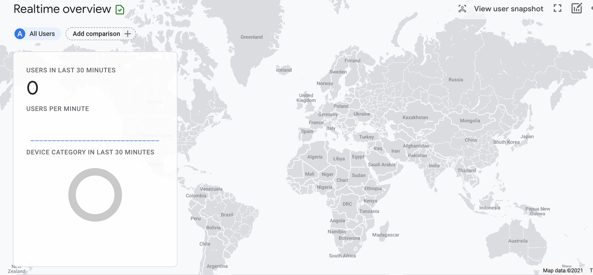

# Lab 10: Katherine Baker and Rachel Doron
[Part 1](https://cse110-lab10-klbaker.canny.io)
## Part 2
Our second split difference is to set the background of the header and the entry columns (not the entry itself) to green.  
[First Split](https://klbaker.github.io/Lab10/)  
[Second Split](https://klbaker.github.io/Lab10/secondSplit.html)  
## Part 3
After working through it for hours, we still weren't able to get data loaded into Google Analytics. I tried to use both
GA4 and Universal Analytics, but neither was working for me. Additionally, I checked back after a few days to see if anything
had loaded, I noticed that user activity had but no information from the tags loaded.
